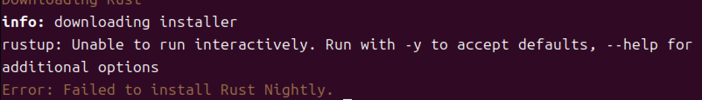
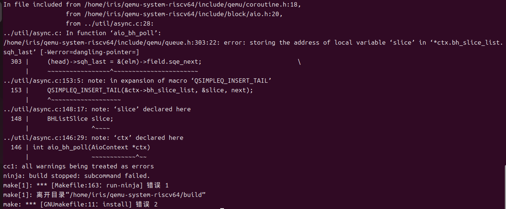
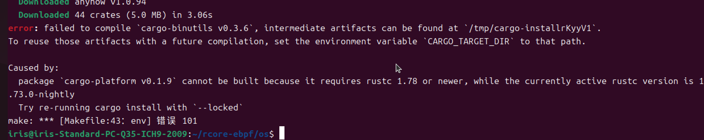

# 复现

## 遇到的问题及解决方案

### M1芯片UTM模拟X86_64 运行ubuntu24.04 LTS（曾小红）

##### 1.运行test.sh，提示无法安装rust



问题是安装脚本在非交互模式下运行，但它需要用户确认默认设置，可以使用 -y **参数自动接受默认选项**，在运行安装命令时，添加 -y 参数跳过交互确认，并指定安装`nightly`版：

```shell
curl --proto '=https' --tlsv1.2 -sSf https://sh.rustup.rs | sh -s -- --default-toolchain nightly -y
```

运行以下命令，让终端能够识别 Rust 的安装路径，这样才能查到rustc，cargo的版本：

```shell
source $HOME/.cargo/env
```

##### 2.编译qemu-system-riscv64报错



```shell
error: storing the address of local variable 'slice' in '*ctx.bh_slice_list' [-Werror=dangling-pointer]
```

可能是因为编译器版本或者环境差异，导致编译出现这个情况（我的编译器启用了 `-Werror`的选项，将代码中的警告视为致命错误，本质原因还是QEMU源代码有问题），这里的解决办法是在编译的时候启用` --disable-werror `参数禁止`-Werror`

```shell
./configure --target-list=riscv64-softmmu,riscv64-linux-user --disable-werror
make -j$(nproc)
sudo make install
```


##### 3.error[E0787]: the `asm!` macro is not allowed in naked functions

根据安装文档中编译rcore-ebpf部分的第四点，我将rustc更新到了较新的版本，进行编译的时候出现了禁止在裸函数中使用 asm! 宏的问题，然后我就将版本切换到了最开始报错要求更新rust版本的最低要求，即1.73.0-nightly：



然后进行编译就成功了。
