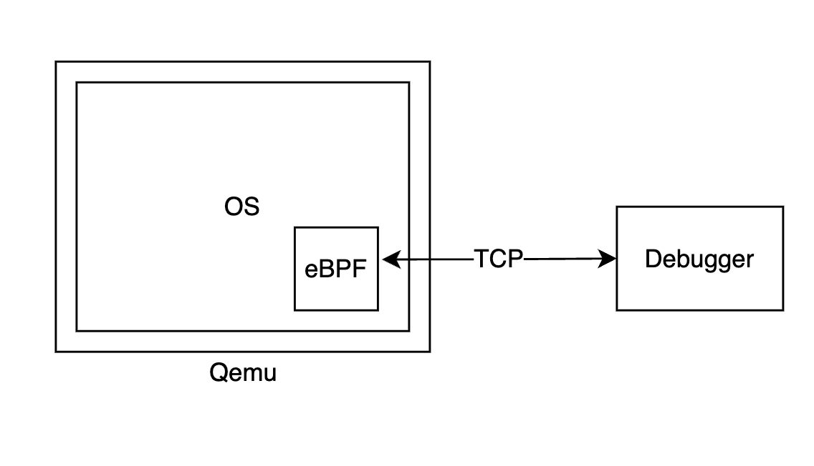

# code-debug

支持 Rust 语言的源代码级内核调试工具

---

## 项目背景与目标

- rust 操作系统相关实验上手难度较高
  - 环境配置繁琐
  - GDB TUI 不方便
- 近期目标
  - 基于 Qemu 的 rust 内核在线调试工具
  - 支持基于 eBPF 的单步断点、内存查看、寄存器查看功能
  - 内核态与用户态方便的切换跟踪
- 远期目标
  - 基于真实系统（FPGA 或 RISC-V 开发板）的远程实验与调试系统
  - 提供低成本、开源的方案

---

## 在线调试系统

- 类似 github classroom，浏览器打开即用
- 调试者与被调试内核分离
- VSCode 插件
  - 操作系统相关的调试功能
- 配置方便
  - 可在单机上使用 docker 直接进行配置
  - 可通过配置 git 仓库路径自动下载其他版本 rust 内核代码进行测试
    - 目前以 rCore-Tutorial-V3 的 main 分支为默认版本

---

## 功能

- 数据获取
  - 寄存器
  - 内存
  - 本地变量
- 跟踪系统调用
  - 准确获取当前特权级
  - 支持在内核态设置用户态程序的断点
  - 自动加载、更换符号信息文件
- 自定义 GDB 语句
- 一键替换代码 

---

## 调试工具设计与实现

1. 支持 GDB 调试
2. 支持通过 VSCode 进行 GDB 调试
3. 解决内核态用户态的断点冲突 

---

## 1. 支持 gdb 调试

- 安装环境：qemu、rust、`riscv64-unknown-elf-gdb`
- 关闭代码优化、保留符号信息
- 自动编译、加载内核和 GDB
- 接口：GDB/MI 

---

## 关闭代码优化、 保留符号信息

- 修改 `cargo.toml` 配置文件中的编译参数
  - `debug=true` 保留调试信息
  - `opt-leve1=0` 最低优化等级
- `linker.ld` 保留\*.debug 段
- 修改后带来的问题
  - 应用程序占用的磁盘空问显著增加，导致 easy-fs-fuse（用于将应用程序打包为文件系统镜像）崩溃
    - 将磁盘镜像的空间调大
  - 用户栈溢出
    - 调整 `USER_STACK_SIZE` 等参数

---

## 2. 支持通过 VSCode 进行 GDB 调试

1. 支持 GDB 调试
2. 支持通过 VSCode 进行 GDB 调试
3. 解决内核态用户态的断点冲突 

---

## 协调 VSCode 与 GDB

- Debug Adapter
  - 负责协调 vSCode 和 GDB 的独立进程
- 消息传送过程 (Debug Adapter Protocol)
  - Request-Response-Event
- 基于 `code-debug` 实现 Debug Adapter
  - 没有查看寄存器、增删符号信息文件等调试操作系统所需的功能，通过 customRequest 添加
    

---

## 实现用户端调试界面

- Extension Frontend
  - 接收来自 DebugAdapter 的消息，发送用户的请求
- Debug Ul
  - 与调试相关的用户界面。
- Text Editor
  - 文本编辑窗口。用户在这个窗口内可以设置断点 
    

---

## 3. 内核态用户态的断点冲突

- GDB 限制：无法在内核态设置用户态代码的断点
- 原因：特权级切换时，TLB 刷新
- 解决思路：暂存断点，待时机合适再设置断点
- 关键问题：暂存断点的策略，恢复断点的时机 

---

## 断点组管理模块

- 分组缓存所有断点的信息
  - 当前断点组
- 若用户设置的断点不属于当前断点组，不令 GDB 设置
- 在特权级切换时切换符号表文件、进行断点组切换
- 扩展：应用于多处理机、多线程、多协程… 

---

## 断点组切换

- 时机：特权级切换
- 行为：清除当前断点组的断点，设置新断点组的断点
- 如何判断是否发生了特权级切换：在特权级切换的代码附近设置断点
  - rCore-Tutorial-v3
    - trap_handler
    - trap_return
  - 如果是别的内核代码，在内核即将进入用户态，以及用户态 trap 到内核态处设置断点
  - 这两个断点可以由 Debug Adapter 自动设置
- 为何需要借助断点来更新特权级信息
  - risc-v 处理器无寄存器能显示反映当前特权级
  - 借助内存地址空间、边界断点、文件名判断

---

## 使用 eBPF 技术

- 为了用上调试器，得改编译参数，改内核代码...比较繁琐
- GDB 无法跟踪 rCore 的一些重要的内核数据结构，对 rust 语言的支持也不是特别好
- 因此，我们想用 eBPF 技术来实现跟踪功能.
  - eBPF 技术使得用户可以在内核执行用户自定义的程序.

---

## 使用 eBPF 技术

- 基本的思路是，用 eBPF
  1. 设置断点，查看内存...
  2. 提供一个 gdbserver 与外部的 gdb 通信 

---

## 项目仓库地址

https://github.com/chenzhiy2001/code-debug

---

## 谢谢！

---
